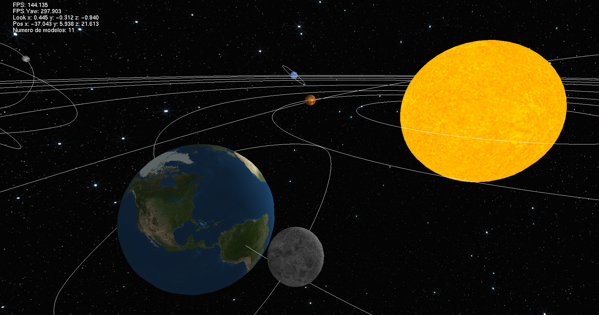
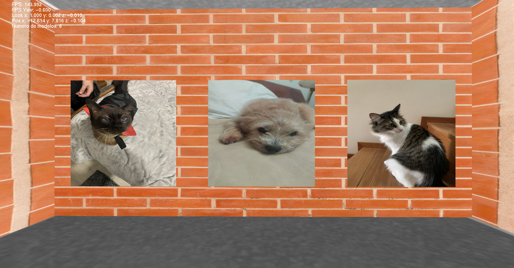
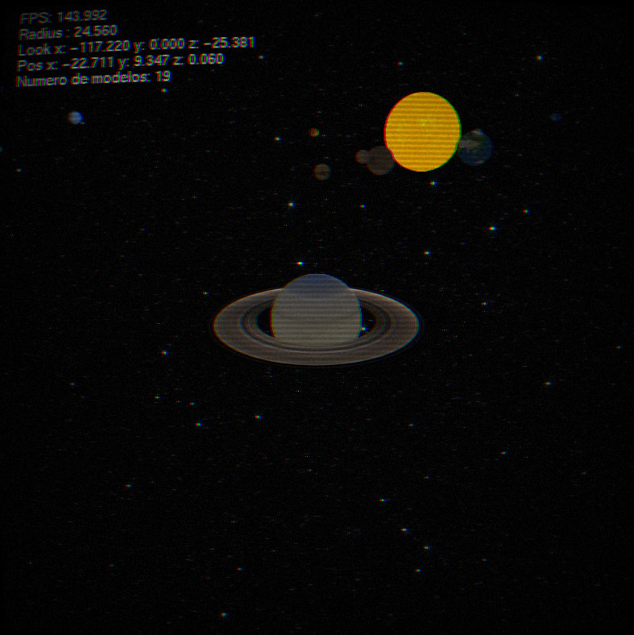
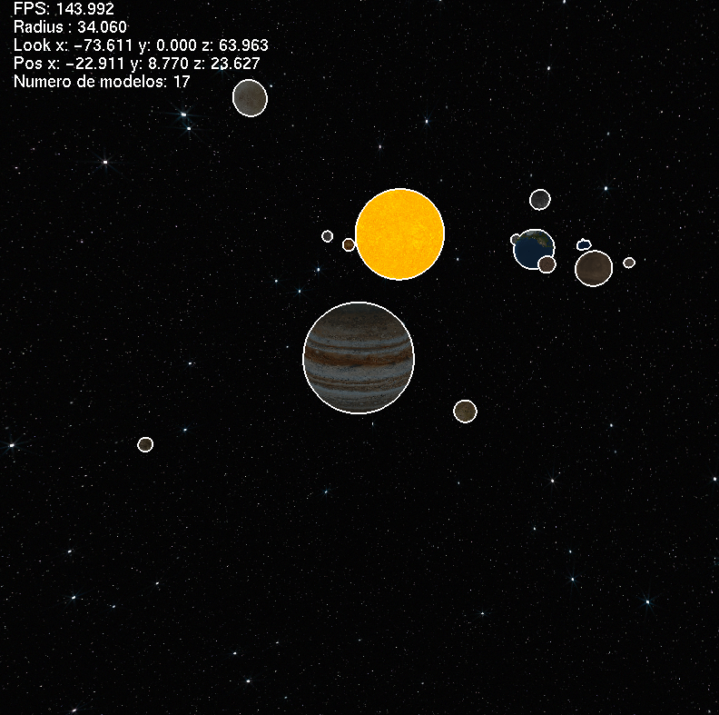

<h3 align="center">Licenciatura em Engenharia Informática   Trabalho prático de Computação Gráfica   2024/2025 </h3>

---

<h3 align="center"> Colaboradores &#129309 </h2>

| Nome             | Número  |
| ---------------- | ------- |
| Tiago Carneiro   | A93207  |
| Tiago Guedes     | A97369  |

# CG2425-Grupo-33 , CG , Uminho 

Nota : ??

## Features

Este projecto apresenta as seguintes funcionalidades : 

 - Gerar primitivas (planos, cubos, esferas, cones, cilindros, torus e superfícies de Bezier).
 - Câmara com modo First Person e Orbital.
 - Texturas de alta qualidade e luzes (pontos de luz, luzes direcionais e focos de luz).
 - View Frustum Culling com bounding boxes.

## Demos

### Sistema Solar

### Vault of the Golden Biscuit

### Shaders

  

